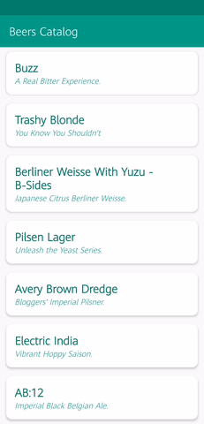
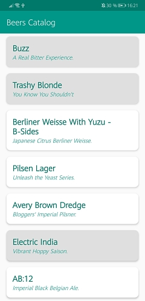
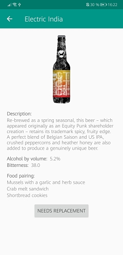
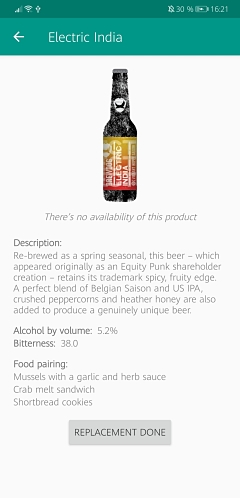

# Beers Catalog
Android app for a taproom bar to display their beers catalog.

The app consists on two screens:

### The first screen shows a list of beers from [PUNK API](https://punkapi.com/documentation/v2):
* Every item contain the name of the beer and the tagline, and its background
must be white if the beer is available or gray otherwise.
* When an item is pressed, the app navigates to a second screen.
* While scrolling download more beers.

### The second screen offers a detailed view of the item, showcasing the following information:
* Name
* Description
* Image
* Alcohol by volume (ABV)
* Bitterness (IBU)
* Food pairing
* Button to notify the barrel is empty and needs replacement. Clicking this button will
toggle the availability of the product.
* Text stating that there’s no availability of this product. This text is shown only if the
product is not available.

# Screenshots

